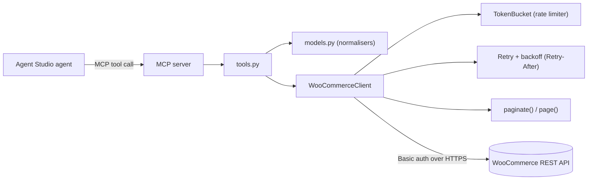

# Agent Studio — WooCommerce Private Connector


A read-only **MCP connector** that lets an Agent Studio agent read **orders,
products, inventory and customers** from a WooCommerce store.

Built for the Razorpay *Forward-Deployed Engineer, Agent Studio* assignment
(Option 3: private connector for a merchant tool).

> **Try it in 10 seconds — no Docker, no credentials, no network:**
> ```bash
> pip install -r requirements.txt
> python demo/demo_offline.py
> ```
> Spins up a mock WooCommerce store in-process and drives the real connector
> against it: auth, filtering, pagination and a simulated `429` that the client
> retries automatically. Captured output in
> [`docs/demo-output.md`](docs/demo-output.md).

---

## The problem this solves

The brief asks for a connector. The job behind the brief is to understand a
merchant's workflow and move a number. So the design starts there, not at the
API.

A D2C merchant's ops team spends **30–60 minutes a day** manually filtering
stuck payments, scanning for stockouts and digging through order history. The
connector turns those questions into **answers in seconds**, grounded in the
merchant's own live data. It is deliberately **read-only first** — an agent
that can mutate a merchant's orders is one that can lose the merchant's money —
and it ships with the metrics to prove it worked.

Full framing, the four merchant questions it unlocks, and the impact metrics:
**[`docs/problem-and-impact.md`](docs/problem-and-impact.md)**.

## Architecture



The MCP server is a **thin adapter over a framework-agnostic core** — the
`connector/` package has no MCP dependency, so the same core could back a REST
service or a different agent host. Details:
[`docs/architecture.md`](docs/architecture.md).

---

## Why WooCommerce

- **Self-hostable:** the whole demo runs locally via Docker — no vendor
  account, no approval wait, and no real credentials anywhere in the repo.
- **Razorpay-relevant:** orders, payments and inventory are exactly the
  merchant commerce data a Forward-Deployed Engineer works with.
- **A real API surface:** genuine pagination, filtering, auth and host-level
  rate limits, so the connector exercises the hard parts honestly.

## What's in the box

```
connector/                 framework-agnostic core (no MCP dependency)
  config.py                env-driven config; secrets never hard-coded
  errors.py                typed errors (Auth/NotFound/RateLimited/Upstream)
  rate_limiter.py          token bucket + backoff-with-jitter
  models.py                normalisers (raw payload -> small, stable dicts)
  woocommerce_client.py    auth, retry, pagination, search primitives
  tools.py                 agent-facing read operations
mcp_server/server.py       MCP server exposing 7 tools
docs/                      auth, tool spec, capabilities, limitations,
                           architecture, problem+impact, webhooks, demo output
demo/                      offline demo (zero setup) + Docker live demo
tests/                     27 tests, no network
pyproject.toml             packaging + ruff / mypy / pytest config
Makefile                   make test | demo | lint | typecheck
```

## Quickstart — real store (Docker)

```bash
cd demo
bash setup_store.sh                  # brings up WordPress + WooCommerce
# create a Read API key at http://localhost:8080/wp-admin
export WC_STORE_URL=http://localhost:8080
export WC_CONSUMER_KEY=ck_...
export WC_CONSUMER_SECRET=cs_...
python seed_data.py                  # sample products + orders
python demo_live.py                  # the connector in action
```

## Configuration

Copy `.env.example` to `.env`. All secrets are read from the environment —
**nothing is hard-coded and nothing secret is ever logged or returned.**

| Variable | Required | Default | Purpose |
|---|---|---|---|
| `WC_STORE_URL` | yes | — | store base URL (HTTPS in production) |
| `WC_CONSUMER_KEY` | yes | — | `ck_...` REST API key |
| `WC_CONSUMER_SECRET` | yes | — | `cs_...` REST API secret |
| `WC_TIMEOUT` | no | 20 | per-request timeout (s) |
| `WC_MAX_RETRIES` | no | 4 | retries on 429/5xx |
| `WC_PER_PAGE` | no | 100 | page size (max 100) |
| `WC_RPS` | no | 5 | client-side request rate |
| `WC_VERIFY_SSL` | no | true | TLS verification |

## Run the MCP server

```bash
python -m mcp_server.server                                   # stdio (MCP hosts)
MCP_TRANSPORT=streamable-http python -m mcp_server.server      # HTTP
```

## Develop

```bash
make dev        # install dev dependencies
make test       # pytest
make cov        # pytest + coverage
make demo       # zero-setup offline end-to-end demo
make lint       # ruff
make typecheck  # mypy
```

Current state: **27 tests passing, 87% coverage, ruff clean.** CI runs lint
plus the tests and the offline demo on Python 3.11 and 3.12.

---

## Design decisions

**Authentication.** HTTP Basic (`ck`/`cs`) over **HTTPS**, never in the query
string. The key is issued with **Read** permission to a dedicated
least-privilege user, so a leak can only read — it cannot damage the store.
Full flow in [`docs/auth.md`](docs/auth.md).

**Pagination / search primitives.** `paginate()` follows the store's
`X-WP-TotalPages` header and streams lazily with an optional `max_items` cap;
`page()` returns one slice plus metadata. This is the *scalable* primitive:
callers bound their own cost. Deep-pagination limits — and the index-backed
long-term fix — are called out honestly in
[`docs/limitations.md`](docs/limitations.md).

**Rate-limit handling.** Two layers: a client-side **token bucket** so we never
hammer the store, and **exponential backoff with jitter** that honours
`Retry-After` on 429/5xx. Exhausted retries raise a typed `RateLimitedError`.

**Normalisation.** Raw WooCommerce objects are large; returning them would blow
up the agent's context and leak fields it shouldn't rely on. Every resource is
projected to a small, documented shape in `models.py`.

**Typed errors.** The agent gets `AuthError`, `NotFoundError`,
`RateLimitedError` or `UpstreamError` — and can reason about them — instead of a
raw stack trace.

**Read-only.** No tool mutates the store. Bounded blast radius by design.

**Event-driven v2.** The request-driven ceiling and the webhook + index design
that removes it are in [`docs/webhooks.md`](docs/webhooks.md).

---

## How this maps to the assignment brief

| Requirement | Where it's satisfied |
|---|---|
| Connector lets an agent read tickets/orders/inventory | `connector/tools.py`, `mcp_server/server.py` (orders, products, inventory, customers) |
| Working demo **or** key authentication flow | **Both:** `demo/demo_offline.py` (zero setup) + `docs/auth.md` |
| Scalable long-term search primitives | `WooCommerceClient.paginate()/page()` + `docs/limitations.md` long-term fix |
| Rate-limit handling | `connector/rate_limiter.py` + retry logic in `woocommerce_client.py` |
| Webhook handling (event-driven) | designed in `docs/webhooks.md` |
| MCP tool specification or equivalent | `docs/mcp-tool-spec.md` |
| Short doc: what the agent can and cannot do | `docs/capabilities.md` |
| Setup steps, restrictions, assumptions, limitations | `README.md` + `docs/limitations.md` |
| No real customer data / secrets | `.env.example` placeholders only; `.env` gitignored |

## Docs index

| Doc | What it covers |
|---|---|
| [`problem-and-impact.md`](docs/problem-and-impact.md) | the merchant problem, and how we'd measure impact |
| [`architecture.md`](docs/architecture.md) | layering, request lifecycle, failure path |
| [`auth.md`](docs/auth.md) | the REST API key authentication flow |
| [`mcp-tool-spec.md`](docs/mcp-tool-spec.md) | every tool, with input/return schemas |
| [`capabilities.md`](docs/capabilities.md) | what the agent can and cannot do |
| [`limitations.md`](docs/limitations.md) | limitations, assumptions, the long-term fix |
| [`webhooks.md`](docs/webhooks.md) | event-driven v2: webhooks + incremental sync |
| [`demo-output.md`](docs/demo-output.md) | captured demo output |
| [`master-plan.md`](docs/master-plan.md) | how this was planned and sequenced |
