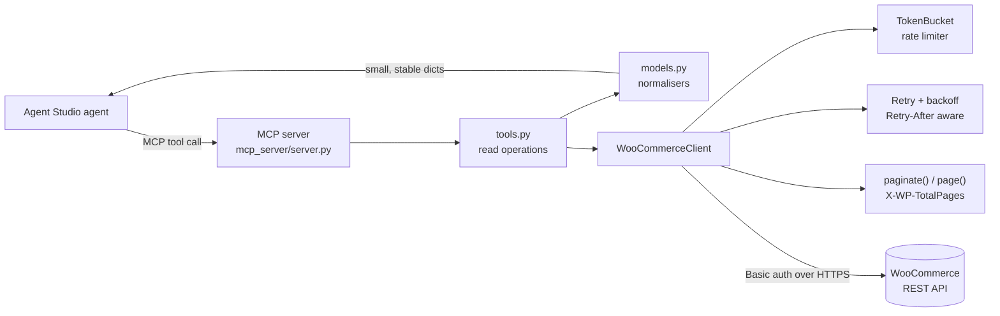
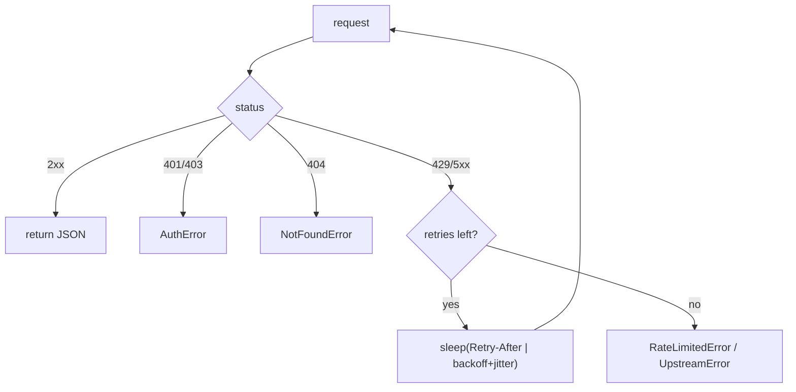

# Architecture

## Shape

## Layering, and why

The code is split so that **the MCP server is a thin adapter over a
framework-agnostic core**:

| Layer | Files | Responsibility | Depends on |
|---|---|---|---|
| Adapter | `mcp_server/server.py` | expose tools to an MCP host | `connector` |
| Operations | `connector/tools.py` | read operations, JSON-ready results | client, models |
| Projection | `connector/models.py` | shrink raw payloads to stable shapes | — |
| Transport | `connector/woocommerce_client.py` | auth, retry, pagination | config, errors, rate limiter |
| Policy | `connector/rate_limiter.py`, `errors.py`, `config.py` | politeness, typed failures, secrets | — |

Why this matters: the connector core has **no MCP dependency**. The same core
could back a REST service, a CLI or a different agent runtime without a
rewrite. That is a deliberate bet on reusability — the thing a Forward-Deployed
Engineer wants when the next merchant uses a different agent host.

## Request lifecycle

1. The agent calls a tool (e.g. `list_orders`).
2. `tools.py` builds the query params and calls the client.
3. The client acquires a token from the **token bucket** (client-side rate
   limiting), then issues the request with **Basic auth over HTTPS**.
4. On `429`/`5xx`, the client retries with **`Retry-After`-aware exponential
   backoff + jitter** up to `WC_MAX_RETRIES`.
5. For list operations, `paginate()` follows `X-WP-TotalPages` lazily and stops
   at `max_items`; `page()` returns one slice plus pagination metadata.
6. `models.py` projects each raw object to a small dict.
7. The tool returns JSON to the agent. Failures surface as **typed errors**
   (`AuthError`, `NotFoundError`, `RateLimitedError`, `UpstreamError`) so the
   agent can decide what to do.

## Failure path

## Deliberate non-goals

- **No writes.** Read-only by design (see `docs/problem-and-impact.md` §3).
- **No live streaming.** Request-driven today; the event-driven v2 is designed
  in `docs/webhooks.md`.
- **No store-side schema assumptions** beyond the documented WooCommerce REST
  contract.
