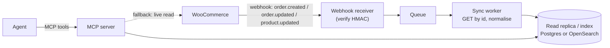

# Event-driven v2: webhooks + incremental sync

Today's connector is **request-driven**: it answers when the agent asks. That
is the right v1, but it has a ceiling — the connector cannot say "tell me when
something happens", and repeated reads re-fetch the same data.

This document is the design for removing that ceiling. It is a design, not an
implementation, and it is deliberately honest about the trade-offs.

## The problem it solves

| Limitation today | Webhook-driven v2 |
|---|---|
| Agent only sees data when it asks | Merchant gets pushed alerts ("3 payments failed") |
| Deep pagination is O(offset) and can skip rows mid-scan | Read from a local index with cursor pagination |
| Every question hits the transactional store | Questions hit a replica; the store is touched only on change |

## Design

1. **Receiver.** An HTTP endpoint that accepts WooCommerce webhook POSTs. It
   verifies the `X-WC-Webhook-Signature` (HMAC-SHA256 of the raw body with the
   webhook secret) before doing anything. Invalid signature → `401`, no work.
2. **Queue.** Enqueue the event id + topic. Decouples ingestion from
   processing and gives at-least-once delivery with retries.
3. **Sync worker.** For each event, fetch the resource by id (or apply the
   payload), normalise with the **existing** `models.py`, and upsert into the
   replica. Idempotent by `(resource, id, modified_gmt)`.
4. **Reads.** The MCP tools switch from the live client to the replica for
   list/search, using **keyset pagination** instead of `?page=N`. The live
   client stays as a fallback and for single-resource reads.
5. **Backfill.** On first connect, run one incremental scan using the
   `modified_after` filter, then hand over to webhooks.

## Trade-offs (the honest part)

- **Delivery is not guaranteed.** Webhooks can be dropped. Mitigation: a
  periodic reconciliation scan (`modified_after=<last_sync>`) as a safety net.
- **Ordering is not guaranteed.** Mitigation: idempotent upserts keyed on
  `modified_gmt`, and ignore events older than what's stored.
- **More moving parts.** A receiver, a queue and a replica are real operational
  surface. This is only worth it once the read volume justifies it — which is
  exactly why it is v2, not v1.
- **PII lands in the replica.** Mitigation: field-level policy at ingestion
  (see `docs/limitations.md`).

## Why it is worth doing

It converts the connector from "a faster way to ask" into "a system that
notices". That is the difference between a tool the merchant uses and a tool
the merchant depends on — and it is where the impact metrics in
`docs/problem-and-impact.md` actually compound.
